# Projeto - Cidades ESGInteligentes

O **EcoCity 360** é uma plataforma focada em cidades inteligentes e práticas ESG (Environmental, Social, and Governance). Esta API gere dados críticos em áreas como consumo de energia, gestão de resíduos, indicadores sociais, governança ambiental e monitorização em tempo real via sensores IoT.

A arquitetura foi desenvolvida num padrão profissional utilizando **Controllers**, separando as regras de negócio em *Services* e garantindo alta testabilidade e manutenção.

## Como executar localmente com Docker

A aplicação e a base de dados foram preparadas para serem executadas num ambiente isolado utilizando Docker Compose, garantindo que rodam em qualquer máquina sem necessidade de configurações complexas.

**Passo a passo:**
1. Certifique-se de que o Docker e o Docker Desktop estão instalados e a correr na sua máquina.
2. Abra o terminal na raiz do projeto (onde se encontra o ficheiro `compose.yaml`).
3. Execute o comando de orquestração:
   ```bash
   docker compose up -d --build
4. Execute os testes para validar o ambiente: 
   ```bash 
    dotnet test

## Estrutura de Testes
### 1. Testes de Comportamento (BDD)
Utilizamos Gherkin para descrever cenários de negócio em linguagem natural. Os arquivos `.feature` estão em `EcoCity.Tests/Features/`.

**Cenários Principais:**
- **Energia:** Monitoramento de faixas de consumo.
- **Resíduos:** Gestão de urgência na coleta por bairro.
- **Sensores IoT:** Alertas baseados em telemetria em tempo real.

### 2. Testes de Contrato (JSON Schema)
Garantimos a integridade da API validando cada resposta contra esquemas JSON predefinidos em `EcoCity.Tests/Schemas/`. Isso impede que alterações no código quebrem integrações externas.

### 3. Cenário de Listagem 
Para a funcionalidade de consulta de resíduos, implementamos a seguinte validação:
- **Ação:** O teste executa uma requisição HTTP do tipo **GET** para o endpoint `/api/Residuos`.
- **Validação de Status e Dados:** Verifica se a API retorna o código **200 OK** e se o corpo da resposta é um **Array JSON**. Internamente, o `ResiduosController` realiza uma busca assíncrona no **MongoDB** para retornar todos os registros.

## Prints do funcionamento

1. Execução Local e Base de Dados (Docker Compose)
   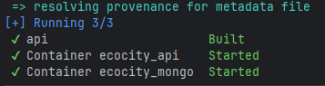

2. Execução do Pipeline CI/CD (GitHub Actions)
   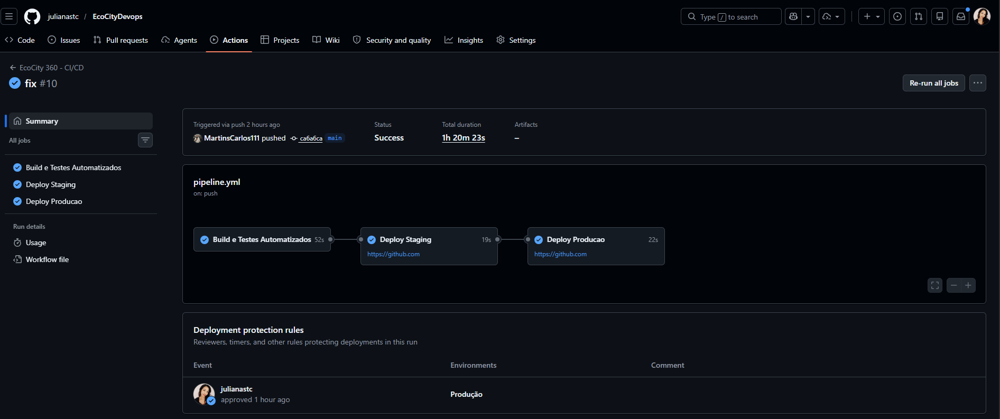

3. Configurações MongoDb
   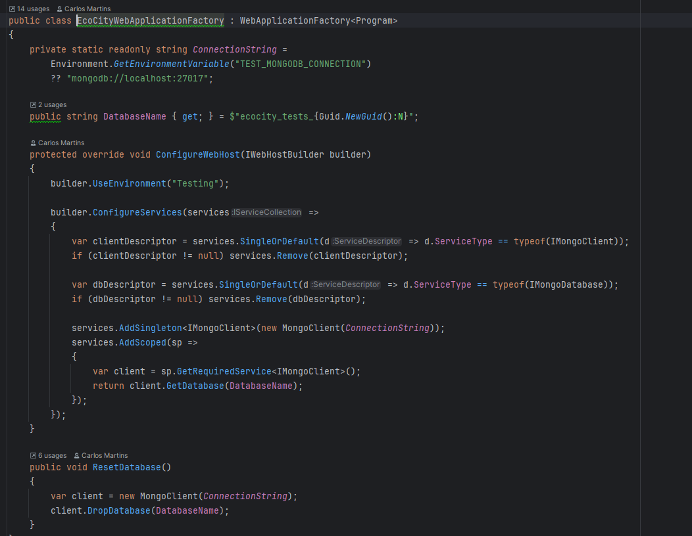
4. Configurações pipeline
   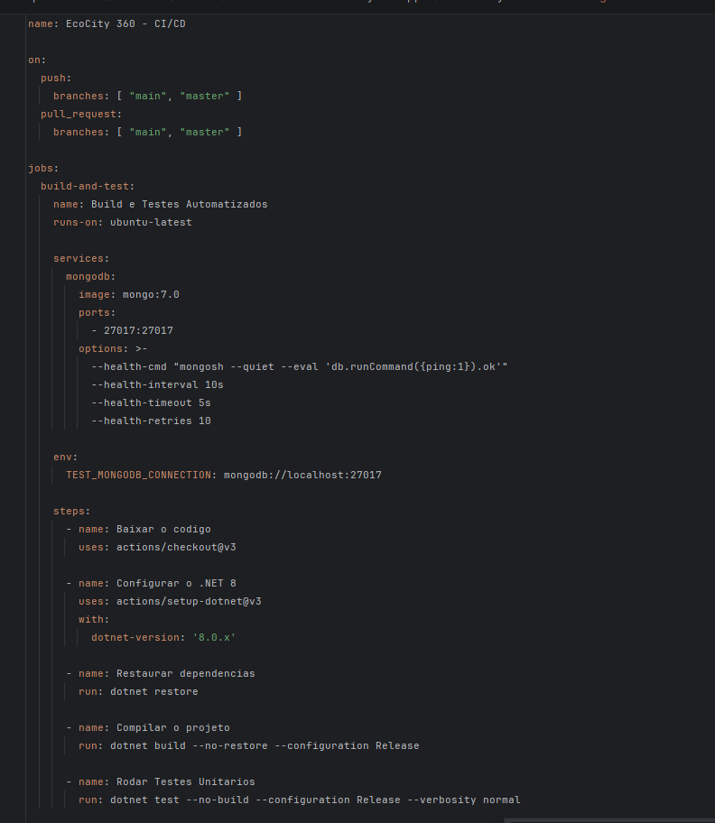
   
5. Cenários Ghenkin
   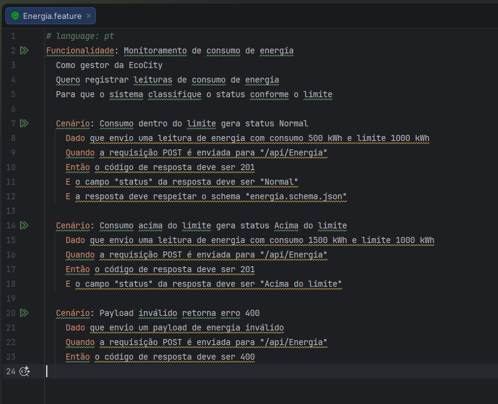
   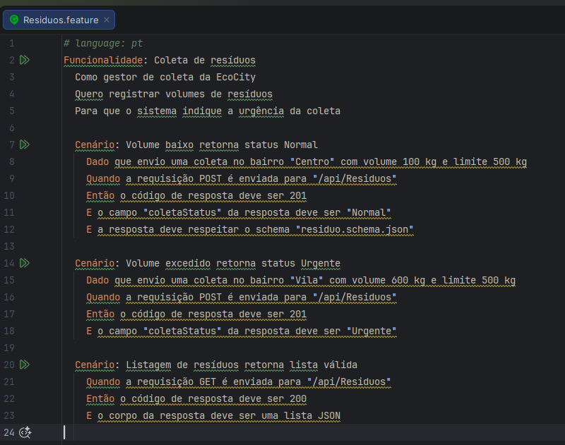
   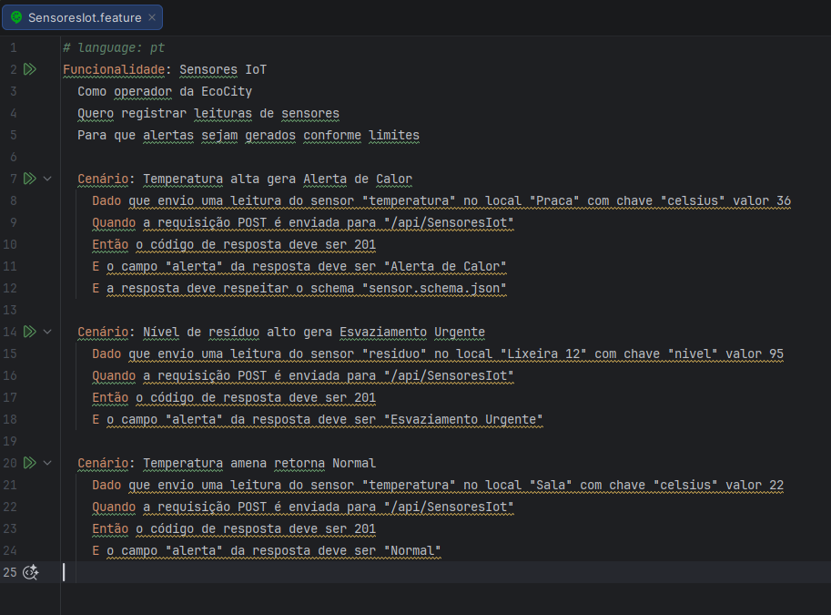

6. Steps BDD
   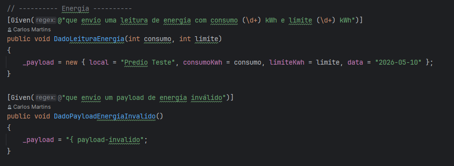
   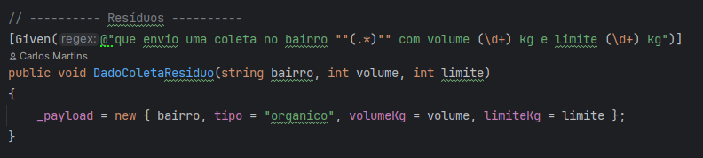
   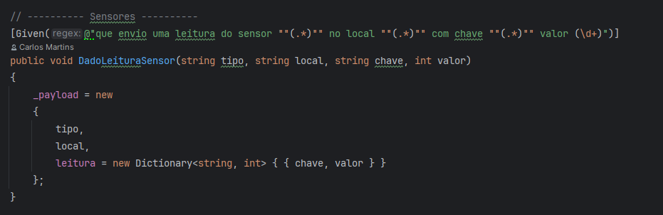
   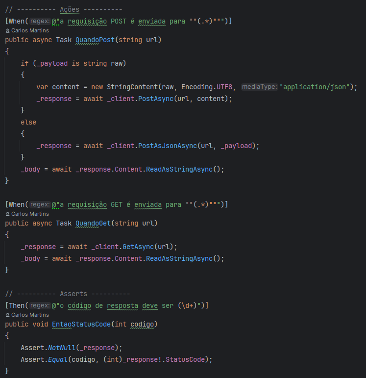
   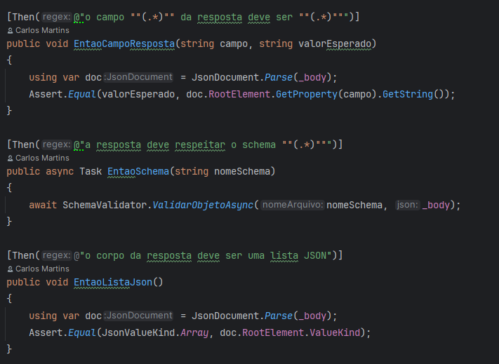

7. Validação de status code
   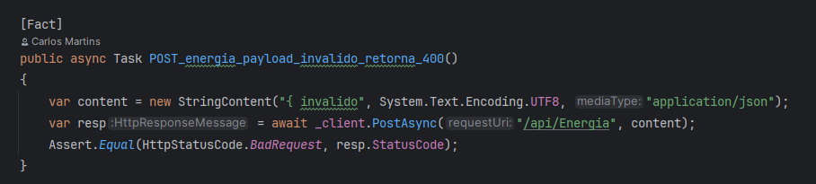
   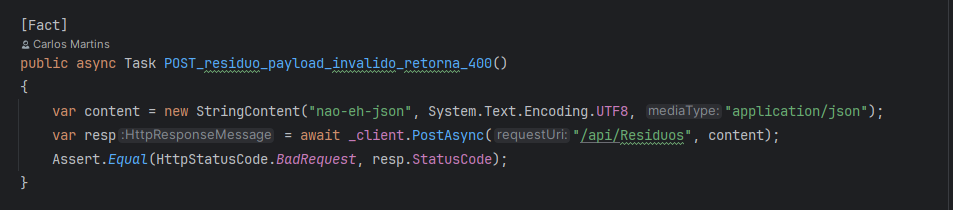
   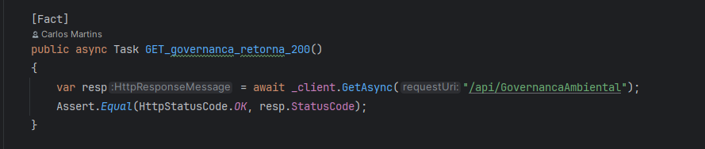


8. Validação de JSON
   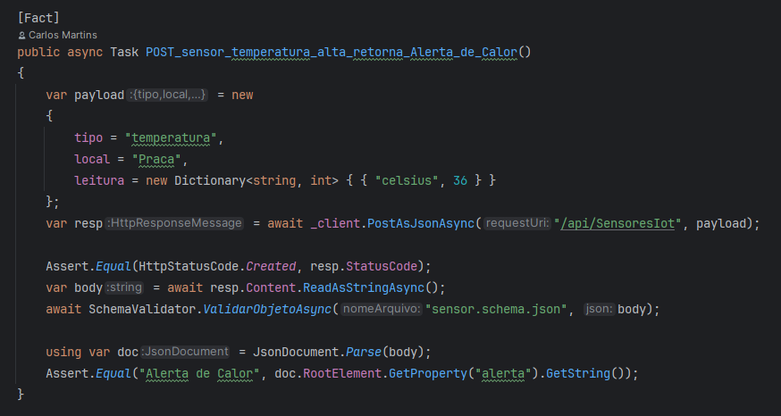
   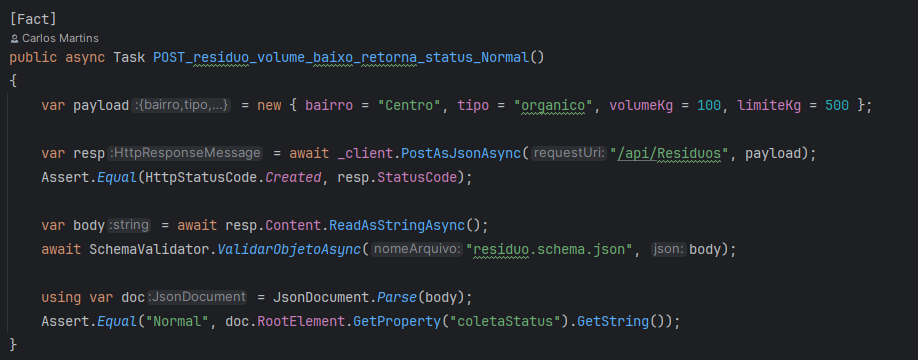
   


9. Testes de contrato utilizando JSON Schema
   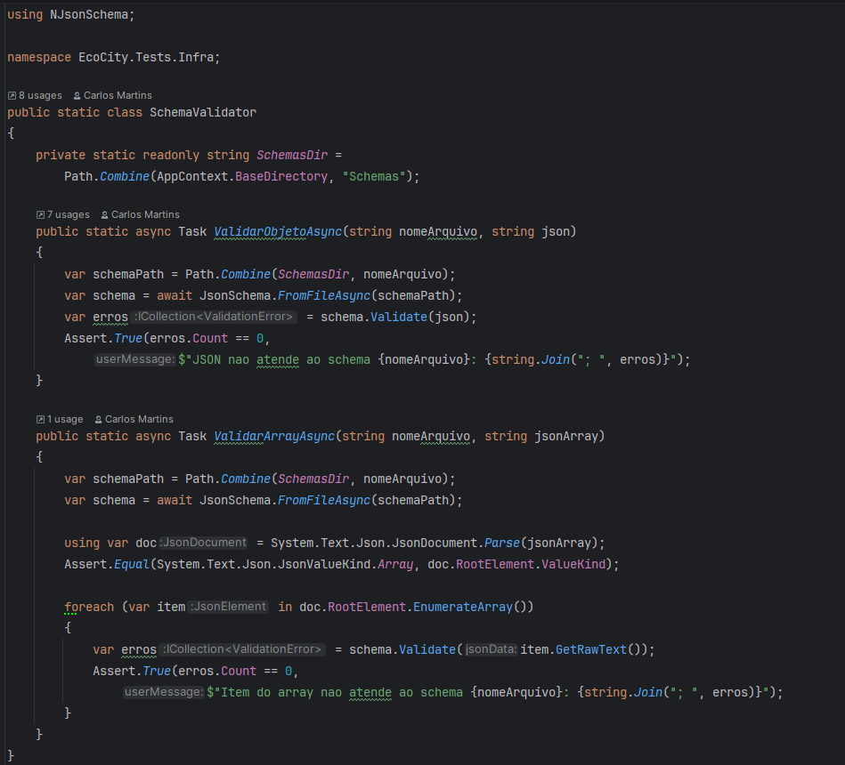


## Tecnologias utilizadas
- Linguagem: C# 12 / .NET 8 (Arquitetura de Controllers)

- Testes Automatizados: xUnit

- Base de Dados: MongoDB (NoSQL) + Driver Oficial C#

- Containerização: Docker e Docker Compose

- Integração e Entrega Contínua (CI/CD): GitHub Actions e GitHub Environments

- IDE: JetBrains Rider

- Controle de Versão: Git e GitHub
- BDD: Reqnroll (Gherkin)
- Validação de Contrato: NJsonSchema
